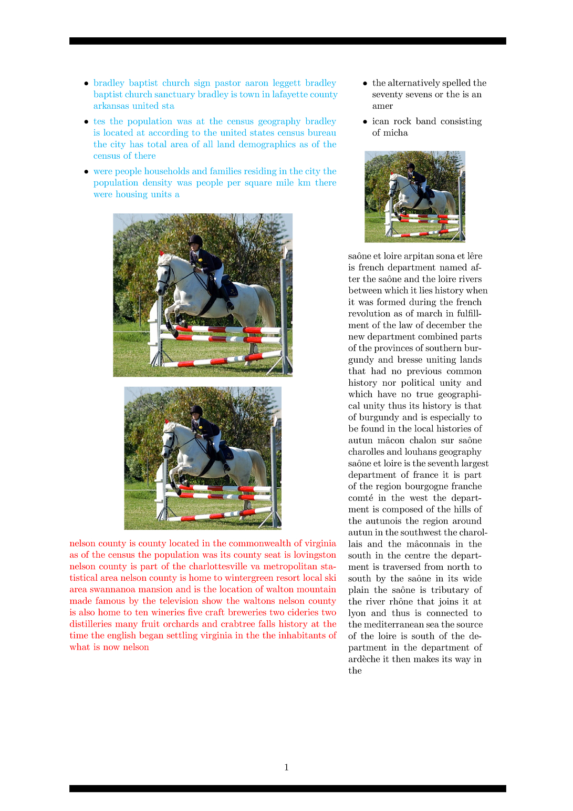
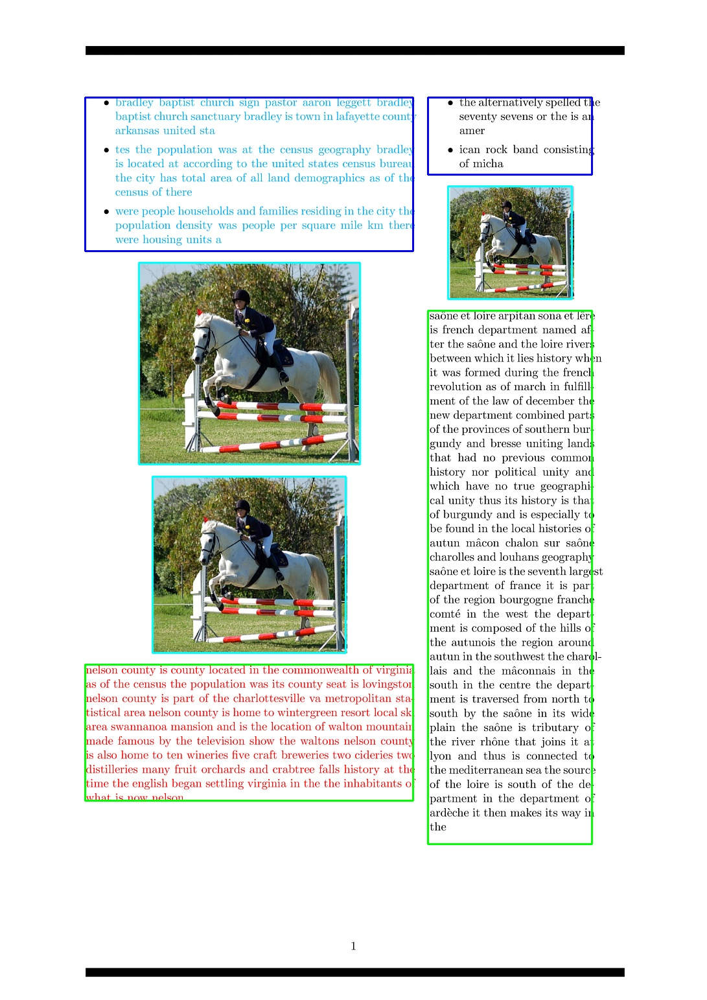

###  Latex generate PDF
---

Code referenced from the paper
http://personal.psu.edu/xuy111/projects/cvpr2017_doc.html
see details from the above paper supplementary link.

Generate LaTeX source files in which elements like paragraphs, figures, tables, captions, section headings and lists are randomly arranged using the “textblock” environment from the “textpos” package. Compiling these LaTeX files gives single, double, or triplecolumn PDFs.


#### 1.Data preparation
1.使用到的图片可以从google pictures下载，或者直接使用CoCo，VOC数据集，将下载后的图片放在data/Images路径下;

2.使用到的table，graph从google pictures下载，下载后的图片放在data/Graphs文件夹下;

3.使用到的语料段落，从维基百科上的下载某个时间段的语料库，将下载后的语料放在data/Doc文件夹下，下载后的语料可以通过 **utils/wiki.py**来提取


#### 2.Environment setup
 [Ref.](https://blog.csdn.net/lfs666666/article/details/88257913)

```python
#Download tex live 2018 [mirror file]     
wget https://mirrors.tuna.tsinghua.edu.cn/CTAN/systems/texlive/Images

# Install needed package for Graphical installation
sudo apt-get install perl-tk

# start installation
sudo mount -o loop texlive.iso /mnt
cd /mnt 
sudo ./install-tl -gui

# finish installation
cd /; sudo umount /mnt

# add path variable
vim ~/.bashrc
export PATH=/usr/local/texlive/2018/bin/x86_64-linux:$PATH
export MANPATH=/usr/local/texlive/2018/texmf-dist/doc/man:$MANPATH
export INFOPATH=/usr/local/texlive/2018/texmf-dist/doc/info:$INFOPATH
source ~/.bashrc

# check installation
tex -v

# use tlmgr to manage texlive package
```


#### 3.How to run

```python
# see details in run.sh
bash run.sh

# main.py input args(img-dir, graph-dir, txt, pageNum)
```


#### 4. Demo output

<center class="half">


</center>

